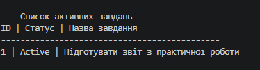

# TaskTracker CLI

TaskTracker CLI — це простий консольний інструмент для швидкого створення, відстеження та управління щоденними завданнями безпосередньо з термінала. Проєкт створено для зручного контролю власних справ і підвищення особистої продуктивності без використання складних графічних програм.

## Встановлення

```bash
# 1. Клонування репозиторію
git clone https://github.com/your-username/task-tracker-cli.git 

# 2. Перехід у директорію проєкту
cd task-tracker-cli

# 3. Встановлення необхідних залежностей
pip install -r requirements.txt  
```
## Використання

Запустіть скрипт із необхідними аргументами для додавання або перегляду завдань:

```bash
# Додавання нового завдання
python main.py add "Підготувати звіт з лабораторної роботи"

# Перегляд усіх активних завдань
python main.py list --status active
```
## Основні команди
| Команда | Параметри | Опис |
| :--- | :--- | :--- |
| `add` | `<title>` | Додає нове завдання до списку |
| `list` | `--status active` | Виводить список активних завдань |
| `delete` | `<task_id>` | Видаляє завдання зі системи |

## Бейджі та демонстрація

[](https://www.python.org/)
[](LICENSE)



## Ліцензія

Цей проєкт розповсюджується під ліцензією **MIT**. Детальнішу інформацію можна знайти у файлі [LICENSE](LICENSE).

## Автори

* **Розробник:** Нестерська Софія
* **Email:** nesterska.s.o_kn25@rcit.ukr.education
* **GitHub:** [профіль](https://github.com/nesterskasokn25)
